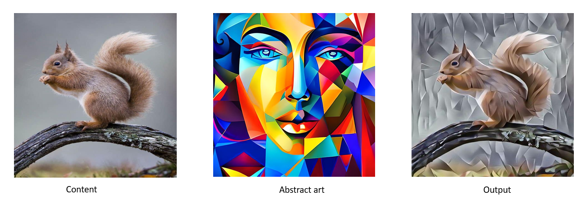

# Image to Art Neural Style Transfer

This project implements Neural Style Transfer using a pretrained VGG19 model to generate artistic images by combining the content of one image with the style of another.

## Sample Output

## Features
- Uses CNN (VGG19) for feature extraction
- Applies content loss and style loss
- Generates artistic outputs (watercolor, oil painting, abstract styles)
- Preserves original image color using YCbCr transformation

## Tech Stack
- Python
- PyTorch
- Torchvision
- NumPy
- PIL

## Results
The model successfully transforms input images into artistic styles while preserving content structure and color consistency.

See:
- Output_Samples.pdf for visual results
- Project report for detailed explanation

## How to Run
1. Install dependencies:
   pip install torch torchvision numpy pillow matplotlib

2. Run:
   python style_transfer.py

## Project Files
- style_transfer.py → main implementation
- Neural_Style_Transfer_Project_Report.pdf → detailed explanation
- Output_Samples.pdf → visual outputs

## Author
Zara Razzaq
